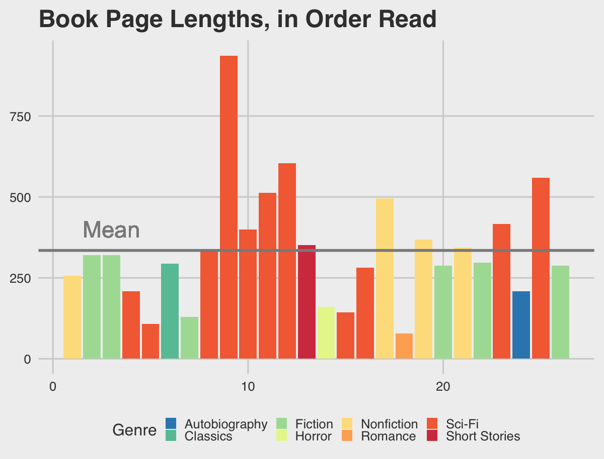

# books-read-2020
Graphics analyzing my reading patterns in 2020

[Evan Meade](https://github.com/Evan-Meade), 2021

This is the code behind the graphics in a long post about my reading habits in 2020. I perform a simple statistical analysis of the books' features, including length, genre, author, year of publication, and order of reading.

To see the full analysis and resulting reading recommendations, see my [blog post](https://keypair.xyz/posts/2020_my_year_in_books).

## Sample Plot

